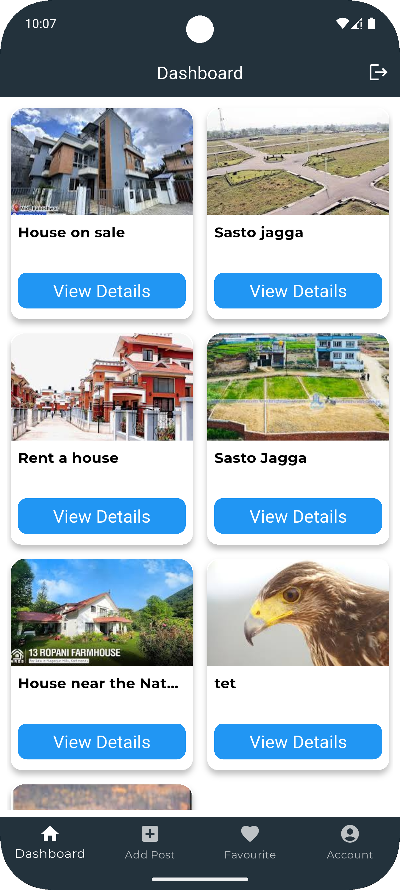
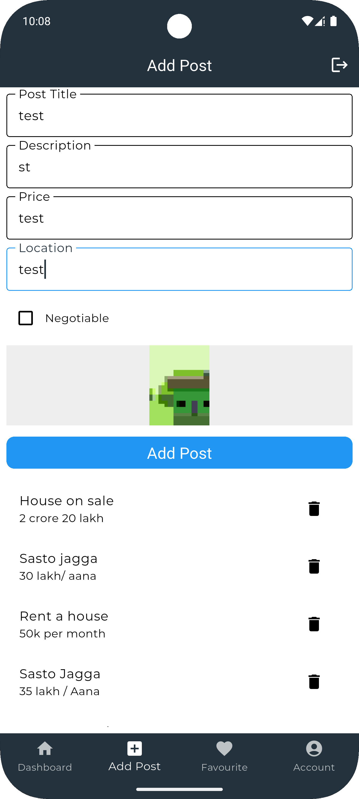
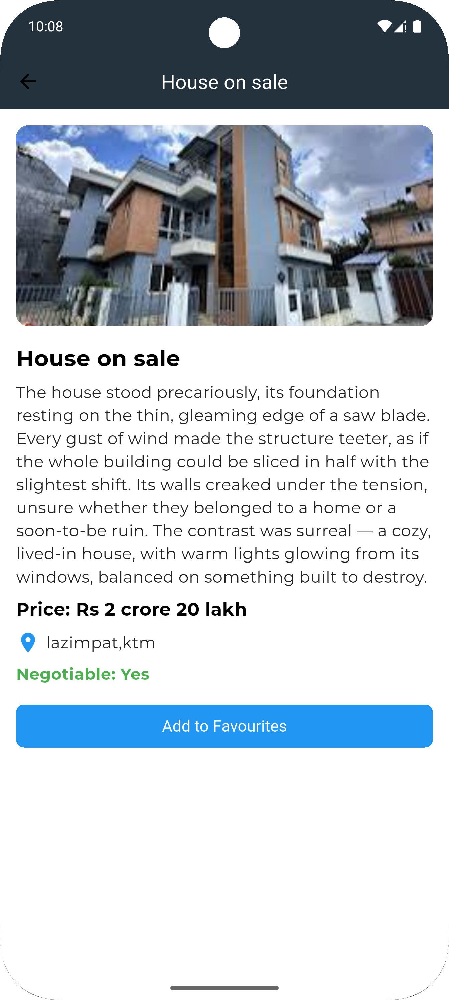
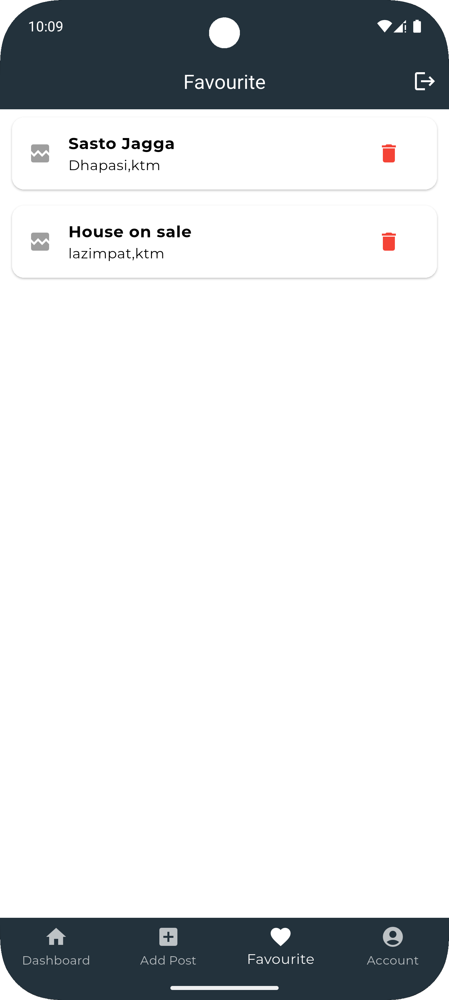
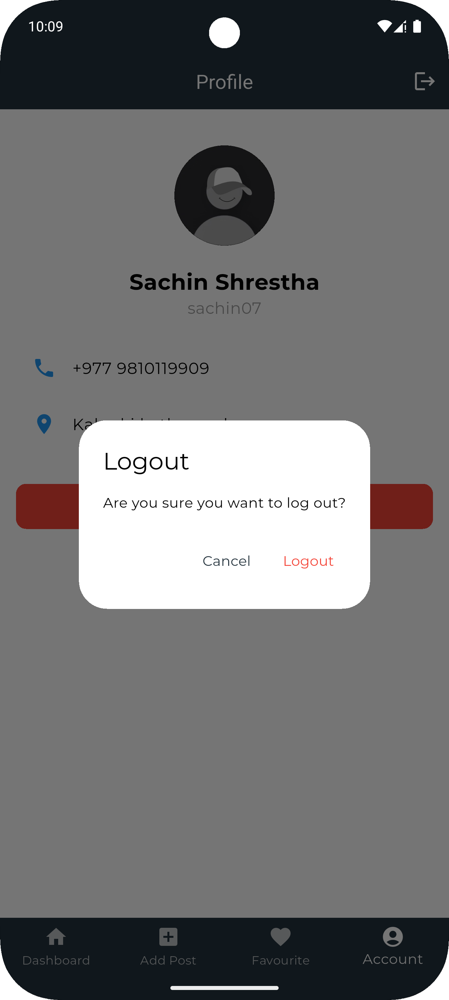

# jaggabazar
Jagga Bazar is a real estate platform built using Flutter,
where users can buy, sell, and rent properties, including houses, apartments, and land. 
The app allows users to browse property listings, view details, and post their own properties for sale or rent.

🚀 Features:
✅ Buy, sell, and rent properties
✅ View detailed property listings with images
✅ Add properties to favorites
✅ Secure user authentication
✅ Clean Architecture with BLoC State Management

🔗 Tech Stack: Flutter, Dart, Firebase, Node.js, MongoDB

## Getting Started

This project is a starting point for a Flutter application.

A few resources to get you started if this is your first Flutter project:

- [Lab: Write your first Flutter app](https://docs.flutter.dev/get-started/codelab)
- [Cookbook: Useful Flutter samples](https://docs.flutter.dev/cookbook)

For help getting started with Flutter development, view the
[online documentation](https://docs.flutter.dev/), which offers tutorials,
samples, guidance on mobile development, and a full API reference.

